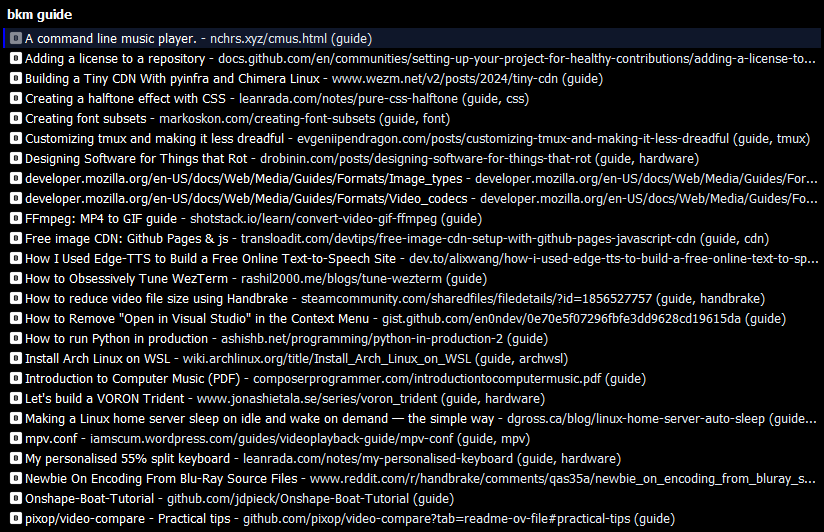

  

# keypirinha-bookmark-txt

Search bookmarks stored in plain text files. Compatible with [qutebrowser](https://www.qutebrowser.org/)'s bookmark format, extended with optional `- tag1,tag2` tags and `\-` escaping (see `data/example.bkm`).

Authors: GLM-5.1🧙‍♂️, scillidan🤡

The icon is from [Input Prompts](https://www.kenney.nl/assets/input-prompts) by [Kenney](https://www.kenney.nl).

## Features

- Fuzzy search via `bkm <query>` (AND logic across raw lines, tags included)
- Per-scheme open commands (`[scheme/https] cmd = brave`)
- `file://` URI support (opens with system default app)
- Multi-directory recursive scan with include/exclude globs
- Experimental auto-sort on file change

See `bookmarktxt.ini` for full usage details.